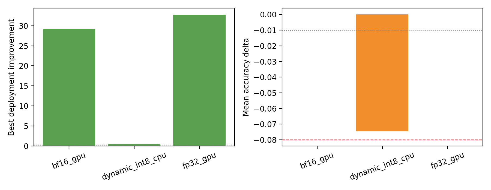
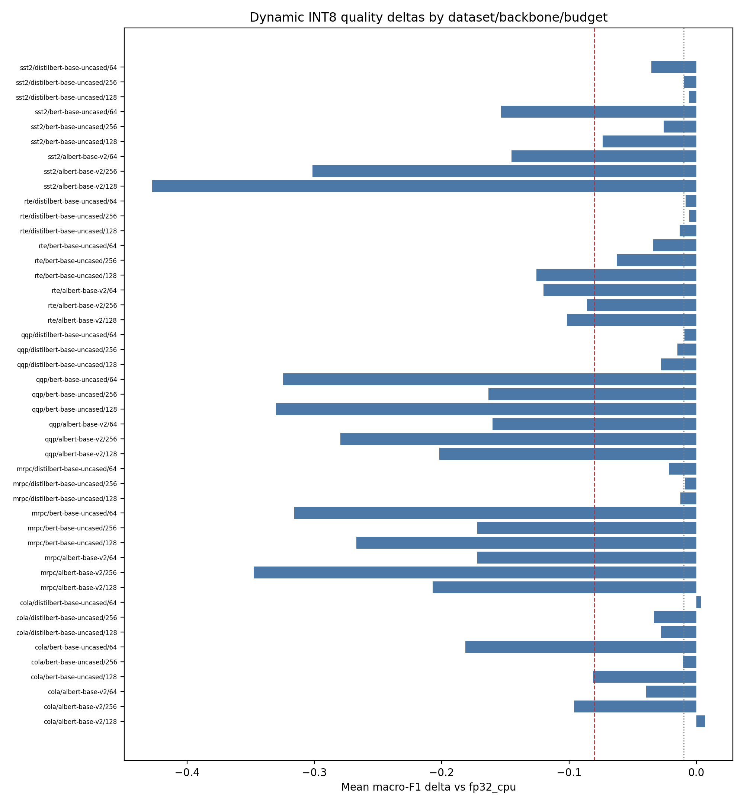
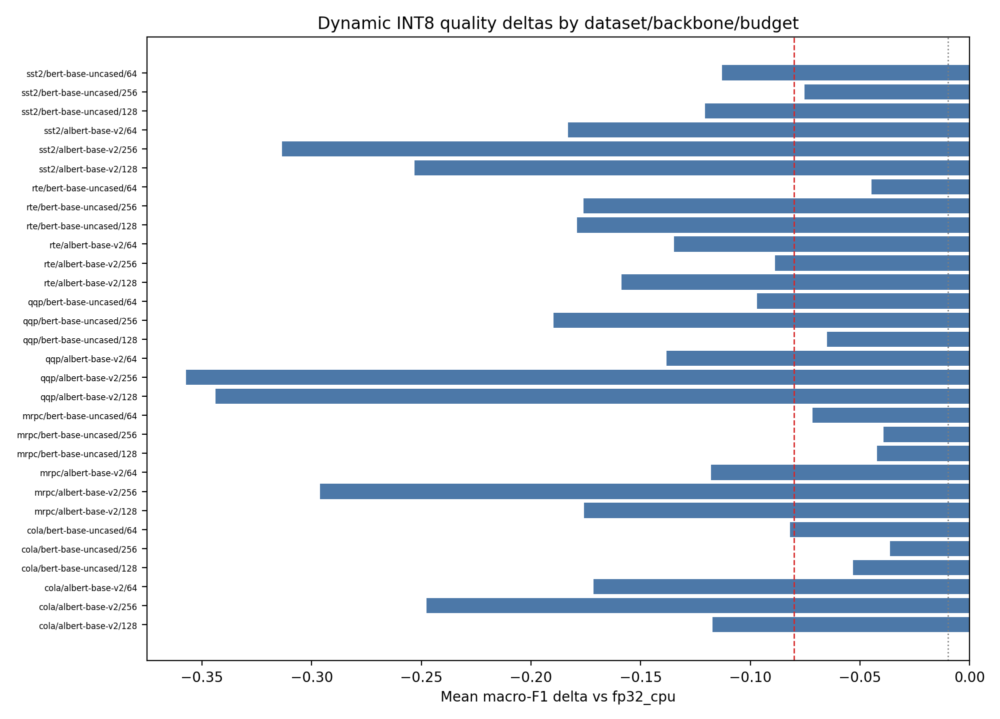

# Dynamic Quantization for Encoder Deployment: Efficiency Gains and Quality Risks

> **Dynamic Quantization for Encoder Deployment: Efficiency Gains and Quality Risks**  
> Yaowen Sun

## Overview

This repository contains reproducibility materials for a controlled deployment study of dynamic INT8 quantization for fine-tuned transformer encoder classifiers. The study compares CPU FP32, CPU dynamic INT8, GPU FP32, and GPU BF16 inference under matched low-resource text-classification cells.

The released evidence contains a 900-row formal matrix and a 360-row strengthened matrix. The primary question is whether dynamic INT8 provides deployment-efficiency gains while preserving accuracy and macro-F1 relative to CPU FP32.

## Repository Structure

```text
.
├── src/
│   ├── dynamic_quant_core.py          # pairing, split, and deployment-gate utilities
│   ├── aggregate_quant_results.py     # matrix aggregation and gate runner
│   ├── analyze_formal_results.py      # Phase 4 summary and figure generation helpers
│   ├── decide_extension_decision.py   # strengthened-matrix decision helper
│   ├── preflight.py                   # local readiness checks
│   └── run_quant_pilot.py             # pilot/formal runner
├── tests/
│   ├── test_dynamic_quant_core.py
│   ├── test_aggregate_quant_results.py
│   ├── test_analyze_formal_results.py
│   ├── test_extension_decision.py
│   └── test_run_quant_pilot.py
├── data/
│   ├── formal_matrix_20260725.csv
│   ├── strengthened_matrix_20260725.csv
│   ├── formal_matrix_summary_20260725.json
│   ├── strengthened_matrix_summary_20260725.json
│   └── formal_phase4_* / strengthened_phase4_* summaries
├── figures/
│   ├── formal_method_tradeoff_summary.png
│   ├── formal_dynamic_int8_macro_f1_delta.png
│   └── strengthened_dynamic_int8_macro_f1_delta.png
├── requirements.txt
├── LICENSE
└── README.md
```

## Experimental Setup

| Dimension | Values |
|---|---|
| Tasks | CoLA; MRPC; QQP; RTE; SST-2 |
| Backbones | `albert-base-v2`; `bert-base-uncased`; `distilbert-base-uncased` |
| Formal budgets | 64; 128; 256 labels per class |
| Formal seeds | 1; 2; 3; 4; 5 |
| Strengthened seeds | 6; 7; 8 |
| Deployment methods | `fp32_cpu`; `dynamic_int8_cpu`; `fp32_gpu`; `bf16_gpu` |
| Inference batch size | 8 |
| Timing repeats | 1 warmup + 5 measured repeats |
| Fine-tuning cap | 3 epochs |

Expected released rows: 900 formal rows plus 360 strengthened rows.

## Hardware and Environment

The experiments use standard PyTorch and Transformers execution paths. Absolute runtime metrics are hardware-dependent, while paired quality deltas are intended to isolate deployment-method effects within matched cells.

Core software dependencies:

| Package | Purpose |
|---|---|
| PyTorch | fine-tuning, inference, and dynamic INT8 quantization |
| Transformers | encoder model loading |
| Datasets | GLUE task loading |
| scikit-learn | classification metrics |
| matplotlib | figure generation |

## Key Results

- In the formal matrix, dynamic INT8 reduces stored model size by 52.2% and improves the best deployment metric by 56.7%, but lowers mean accuracy by 0.0746 and mean macro-F1 by 0.1162.
- In the formal matrix, 102 of 225 paired dynamic INT8 cells cross the severe quality-drop trigger.
- In the strengthened matrix, dynamic INT8 retains a 54.2% model-size reduction and 55.7% best deployment-metric improvement, but mean accuracy and macro-F1 drops increase to 0.0903 and 0.1494.
- GPU FP32 and GPU BF16 preserve quality while providing large runtime gains when accelerator resources are available.
- The practical recommendation is conditional: dynamic INT8 can be useful for size- and CPU-constrained deployments, but should be validated on the target task and backbone before use.

## Requirements

Install the minimal runtime dependencies:

```bash
pip install -r requirements.txt
```

## Data Format

`data/formal_matrix_20260725.csv` and `data/strengthened_matrix_20260725.csv` contain one row per deployment-method evaluation. Important columns include `matrix`, `dataset`, `backbone`, `label_budget_per_class`, `seed`, `method`, `status`, `accuracy`, `macro_f1`, `model_size_mb`, `latency_ms_per_example`, and `throughput_examples_per_second`.

The Phase 4 summary files provide paired deltas, method-level summaries, group summaries, and strengthened-trigger evidence derived from the raw matrix rows.

## Reproducing the Analysis

Run the focused tests:

```bash
PYTHONPATH=src python -m unittest discover -s tests
```

Regenerate formal summaries:

```bash
PYTHONPATH=src python src/analyze_formal_results.py \
  --results data/formal_matrix_20260725.csv \
  --summary data/formal_matrix_summary_20260725.json \
  --output-dir outputs/formal_phase4 \
  --figure-dir outputs/figures \
  --artifact-date 20260725 \
  --artifact-prefix formal_phase4
```

Regenerate strengthened summaries:

```bash
PYTHONPATH=src python src/analyze_formal_results.py \
  --results data/strengthened_matrix_20260725.csv \
  --summary data/strengthened_matrix_summary_20260725.json \
  --output-dir outputs/strengthened_phase4 \
  --figure-dir outputs/figures \
  --artifact-date 20260725 \
  --artifact-prefix strengthened_phase4 \
  --figure-prefix strengthened
```

Re-running the full matrix requires locally cached model and dataset assets plus sufficient CPU/GPU time. The released CSV/JSON files are the compact evidence used for the reported analysis.

## Figures







## Citation

```bibtex
@article{sun2026dynamic_quantization_encoder_deployment,
  title  = {Dynamic Quantization for Encoder Deployment: Efficiency Gains and Quality Risks},
  author = {Sun, Yaowen},
  year   = {2026}
}
```
